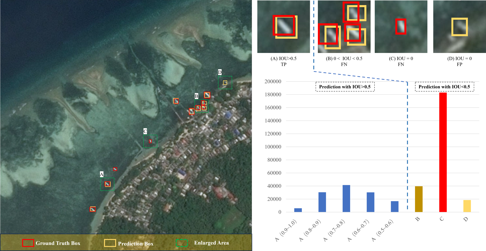
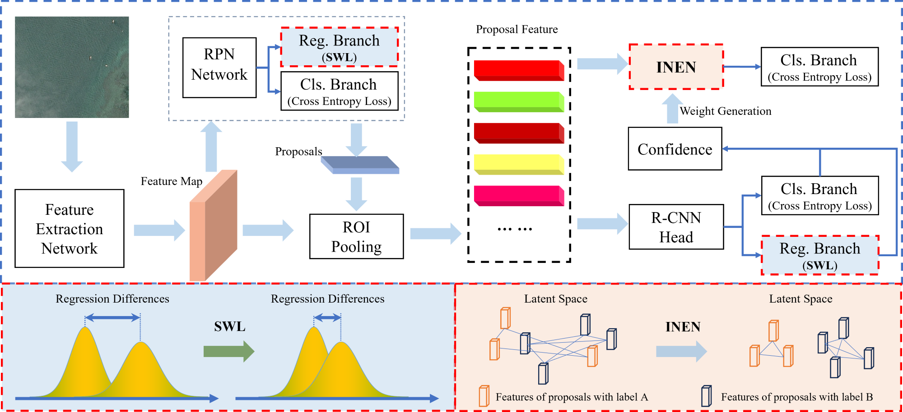
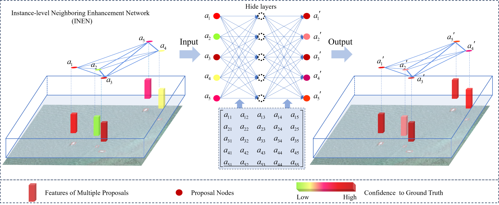
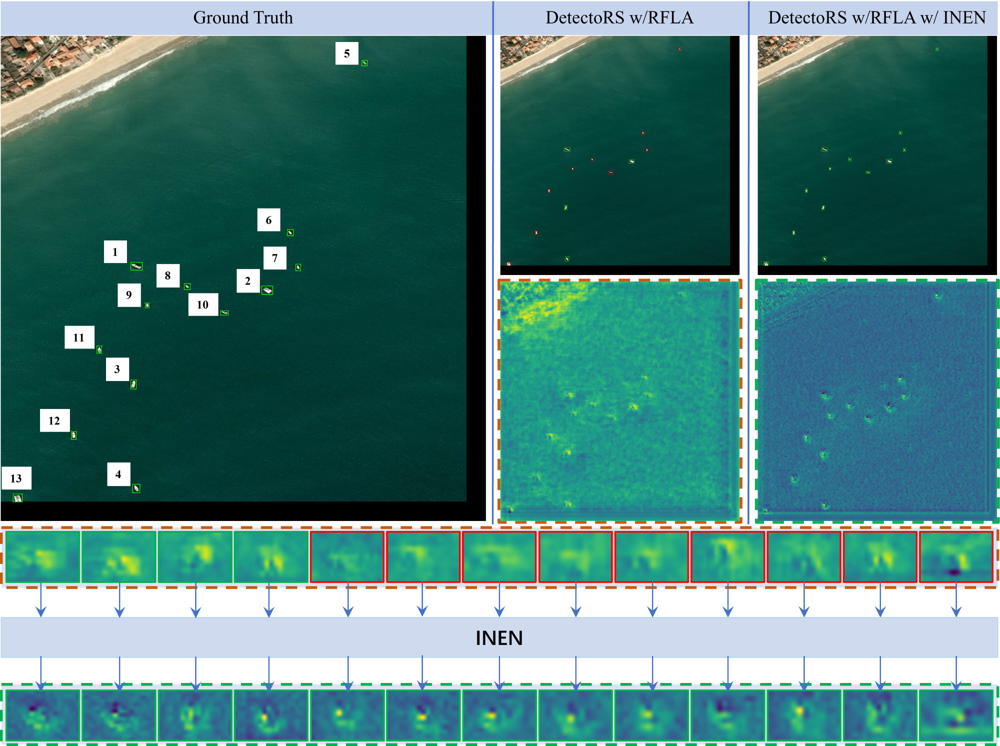
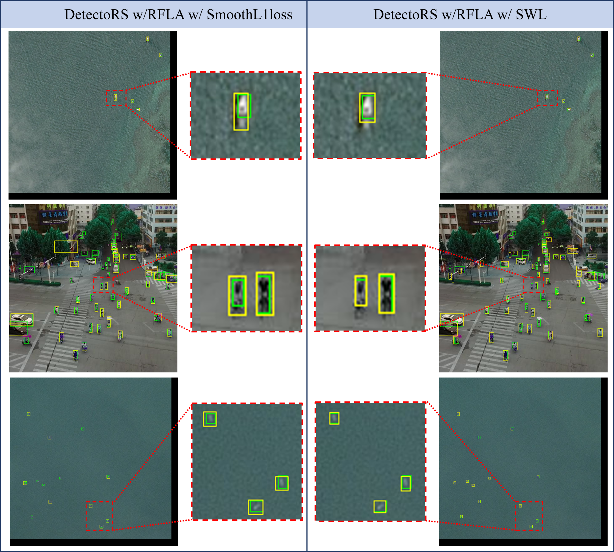

# SWIN-TOD
This is the official implementation of the paper "SWIN-TOD: Smooth Wasserstein Distance and Instance-level Neighboring Enhancement for Remote Sensing Tiny Object Detection".

## Introduction
SWIN-TOD contains two main modules: Instance-level Neighboring Enhancement Network (INEN) and the Smooth Wasserstein Loss (SWL).

**Abstract**: The advancement of deep neural network technology has propelled the widespread application of remote sensing target detection. However, compared to natural scenes, remote sensing targets possess inherent characteristics such as weak features and small scales, leading to a significant performance gap in traditional detection methods. To address these challenges, a principled analysis of existing approaches is conducted, focusing on two key aspects: inadequate extraction of discriminative features and inappropriate regression measurement metric. To tackle the first issue, an Instance-level Neighboring Enhancement Network (INEN) is proposed, enhancing the network's feature extraction capability through inter-object feature learning. To address the second issue, a novel metric parameter, Smooth Wasserstein Loss (SWL), is devised. Building upon these principles, a remote sensing small target detection network is developed. Extensive experiments on AI-TOD v1/v2 and DOTA v2 remote sensing tiny target detection datasets demonstrate that our approach achieves state-of-the-art (SOTA) performance.

**Challenges**:


**Pipeline of network**:



**INEN**:



## Installation and Get Started

Required environments:
* Linux
* Python 3.6+
* PyTorch 1.3+
* CUDA 9.2+
* GCC 5+
* Pyg
* [MMCV](https://mmcv.readthedocs.io/en/latest/#installation)
* [cocoapi-aitod](https://github.com/jwwangchn/cocoapi-aitod)


Install:

Note that this repository is based on the [MMDetection](https://github.com/open-mmlab/mmdetection). Assume that your environment has satisfied the above requirements, please follow the following steps for installation.

```shell script
git clone https://github.com/sevenwgb/SWIN-TOD.git
cd SWIN-TOD
pip install -r requirements/build.txt
python setup.py develop

```

NEW!!!
For YOLO series, such [YOLOv5](https://github.com/ultralytics/yolov5)  [YOLOv9](https://github.com/WongKinYiu/yolov9)
The newly added "ForYOLO" folder can be used to embed SWIN into the YOLO framework. Simply add or replace the code in this folder with the official YOLO code.


About YOLOv9 experiments:

Note that the experiments of YOLOv9 is conducted on the [YOLOv9](https://github.com/WongKinYiu/yolov9)
```
# train yolov9 models
python -m torch.distributed.launch --nproc_per_node 4 --master_port 9527 train_dual.py --workers 4 --device 0,1,2,3 --sync-bn --batch 4 --data data/aitodv1.yaml --img 800 --cfg models/detect/yolov9-c.yaml --weights '' --name yolov9-c --hyp hyp.scratch-high.yaml --min-items 0 --epochs 500 --close-mosaic 15
# val
python val.py --data data/aitod.yaml --img 800 --batch 32 --conf 0.001 --iou 0.7 --device 0 --weights 'path/to/your weights (e.g. best.pt)' --save-json --name yolov9_c_c_800_val

```


## Visualization
The images are from the AI-TOD v1/v2, and DOTA-v2 datasets. Note that the <font color=green>green box</font> denotes the True Positive, the <font color=red>red box</font> denotes the False Negative and the <font color=blue>blue box</font> denotes the False Positive predictions.

**High-quality results**:


**Effectiveness of INEN**:


**Effectiveness of SWL**:


## Citation

